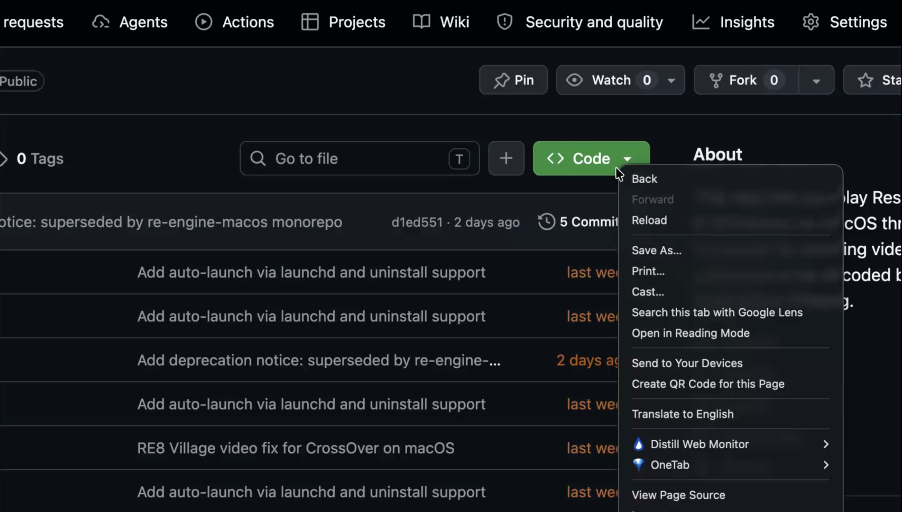

# RE Engine macOS - Video Fix for CrossOver

Fixes broken cutscene/intro video playback for RE Engine games running on macOS via CrossOver. Wine's GStreamer pipeline stalls on ASF/WMV media streams used by these games -- this project bypasses it entirely with a shim DLL and macOS-side decode server.

## Supported Games

| Game | Status | Pre-built DLL | Notes |
|------|--------|---------------|-------|
| Resident Evil 3 (2020) | Verified | Yes | Tested on M3 Pro, CrossOver 26.1.0 |
| Resident Evil Village / RE8 (2021) | Verified | Yes | Tested on M3 Pro, CrossOver 26.1.0 |
| Resident Evil 7 (2017) | Untested | No | Has native macOS port; this is for Steam/Windows via CrossOver |
| Resident Evil 2 (2019) | Untested | No | PCGamingWiki confirms MF-related cutscene issues |
| Resident Evil 4 (2023) | Untested | No | Has native macOS port; this is for Steam/Windows via CrossOver |

**Verified** = tested and confirmed working. **Untested** = should work (same engine, same MF pipeline) but hasn't been tested. The install script will warn you before proceeding with untested games.

## How It Works

```
Game (Wine)                    macOS
-----------                    -----
game.exe                       decode_server.sh
  |                              |
  +--> MFCreateSourceReader      |
  |      |                       |
  |      +--> dump <pfx>_movie_N.bin --> ffmpeg decode
  |      |                       |         |
  |      +--> ReadSample         |         v
  |      |      |                |    <pfx>_video_N.nv12
  |      |      +--> read frame <--------+
  |      |      |    from .nv12  |
  |      v      v                |
  |    video displayed           |
```

**MF Shim DLL** (`mfreadwrite.dll`) -- A Windows DLL placed in the game directory that intercepts `MFCreateSourceReaderFromByteStream`. Instead of calling into Wine's broken MF/GStreamer pipeline, it dumps the video stream to disk and serves decoded NV12 frames from a file produced by the decode server.

**Decode Server** (`decode_server.sh`) -- A macOS-side background process that watches for dumped `.bin` files and decodes them to raw NV12 using `ffmpeg`. The output file grows progressively so the shim can start serving frames before decoding finishes.

## Requirements

- **macOS** on Apple Silicon (tested on M3 Pro)
- **CrossOver** 26.x (tested with 26.1.0)
- **Game** installed via Steam in a CrossOver bottle
- **ffmpeg**: `brew install ffmpeg`
- **mingw-w64** (only for building from source or untested games): `brew install mingw-w64`

## Quick Start

[](./media/screen-recording.mp4)

```bash
# Clone this repo
git clone https://github.com/l00sed/re-engine-macos.git
cd re-engine-macos

# Install for a verified game (pre-built DLL included)
./install.sh re3
# or
./install.sh re8

# That's it. Launch the game from Steam normally.
# The decode server starts and stops automatically via launchd.
```

For untested games, build the DLL first:

```bash
./build.sh re7        # or re2, re4
./install.sh re7      # will warn "untested", prompt to continue
```

### Custom Bottle Name

If your bottle isn't named "Steam":

```bash
./install.sh re3 --bottle "My Bottle"
./play.sh re3 --bottle "My Bottle"
```

### Manual Launch

If you prefer to manage the decode server yourself instead of using launchd:

```bash
./play.sh re8   # starts decode server, launches game, cleans up on exit
```

## Installation Details

`install.sh <game>` does the following:

1. **Copies `mfreadwrite.dll`** from `shim/out/<game>/` into the game directory
2. **Sets DLL overrides** in the Wine bottle:
   - `mfplat` = `native,builtin`
   - `mfreadwrite` = `native,builtin`
3. **Sets environment variables** (game-specific, if any -- e.g. RE8 needs `D3DM_ENABLE_METALFX=0` and `DXMT_ENABLE_NVEXT=0`)
4. **Disables CrashReport.exe** (game-specific, if needed -- e.g. RE8)
5. **Installs a launchd agent** -- auto-starts the decode server when the game runs (triggered by a flag file the shim creates on load)

## Building from Source

```bash
# Build DLL for a specific game
./build.sh re3

# Or build manually
brew install mingw-w64
x86_64-w64-mingw32-gcc -shared -DGAME_PREFIX=\"re3\" \
    -o shim/out/re3/mfreadwrite.dll \
    shim/mfreadwrite_shim.c shim/mfreadwrite.def \
    -Wl,--enable-stdcall-fixup -lole32
```

The DLL is parameterized by `GAME_PREFIX` at compile time. All file paths (bin dumps, NV12 output, info files, flag file, log file) are derived from this single prefix.

## File Structure

```
.
├── install.sh                    # Install fix for a game
├── uninstall.sh                  # Remove fix for a game
├── play.sh                       # Manual launch with decode server
├── build.sh                      # Build DLL for a game
├── games/
│   ├── re3.conf                  # RE3 config (verified)
│   ├── re8.conf                  # RE8 config (verified)
│   ├── re7.conf                  # RE7 config (untested)
│   ├── re2.conf                  # RE2 config (untested)
│   └── re4.conf                  # RE4 config (untested)
├── shim/
│   ├── mfreadwrite_shim.c        # Shared shim DLL source (~1170 lines)
│   ├── mfreadwrite.def           # DLL export definitions
│   └── out/
│       ├── re3/mfreadwrite.dll   # Pre-built DLL for RE3
│       └── re8/mfreadwrite.dll   # Pre-built DLL for RE8
└── scripts/
    └── decode_server.sh          # Parameterized decode server
```

## Adding a New Game

1. Create `games/<id>.conf` following the existing pattern (see `games/re3.conf` as a template)
2. Set `GAME_DIR_NAME` to the exact folder name in `steamapps/common/`
3. Set `GAME_EXE` to the game's main executable
4. Set `GAME_PREFIX` to a short unique prefix (e.g. `re2`)
5. Build the DLL: `./build.sh <id>`
6. Install: `./install.sh <id>`
7. Test and update `STATUS` to `verified` if it works

## Debugging

Each game's shim writes a log to `C:\mf_shim_<PREFIX>_debug.log` inside the Wine bottle:
```
~/Library/Application Support/CrossOver/Bottles/<bottle>/drive_c/mf_shim_<PREFIX>_debug.log
```

The decode server logs to `~/Library/Logs/<game>-decode-server.log`.

## Uninstalling

```bash
./uninstall.sh re3
./uninstall.sh re8
```

This removes the launchd agent, shim DLL, temp files, and restores CrashReport.exe if it was disabled. DLL overrides and environment variables are left in the bottle config (remove manually via CrossOver's Wine Configuration if needed).

## RE8 Users: Breaking Change

If you previously used [re8-village-macos](https://github.com/l00sed/re8-village-macos), the file naming convention has changed:
- `movie_*.bin` -> `re8_movie_*.bin`
- `mf_shim_debug.log` -> `mf_shim_re8_debug.log`

**Uninstall the old version first** before installing from this repo.

## Technical Background

1. **Wine MF/GStreamer bug**: Wine translates MF calls to GStreamer, but the pipeline stalls on ASF container streams -- likely a threading issue in `wg_parser` under Rosetta 2.
2. **Missing export**: The game's native MF DLLs import `MFGetCallStackTracingWeakReference` from `mfplat.dll`, which Wine's builtin doesn't export. Fixed by using native `mfplat.dll`.
3. **Frame pacing**: RE Engine's movie player requires real-time paced frame delivery (~33ms per frame). Returning all frames at once or immediate EOS breaks the video state machine.
4. **Auto-detection**: The decode server writes `.info` sidecar files with frame count and dimensions. The shim reads these to know the exact video duration instead of using hardcoded lookup tables.

## License

MIT
